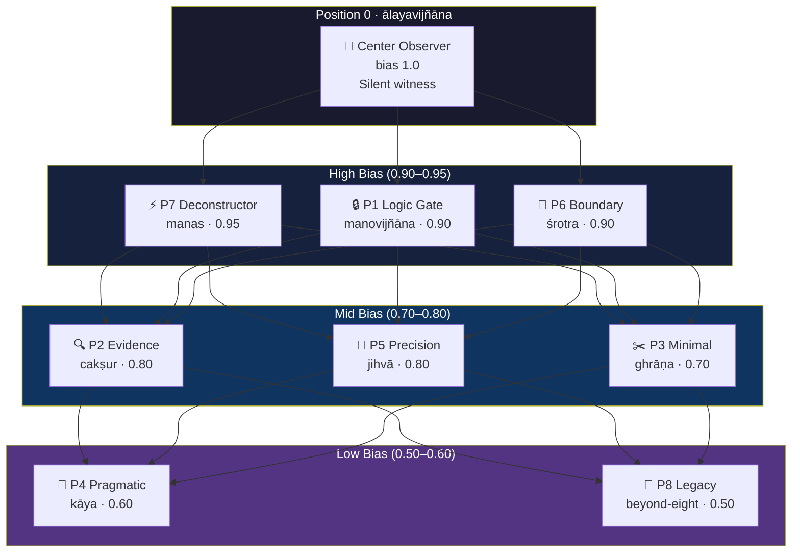
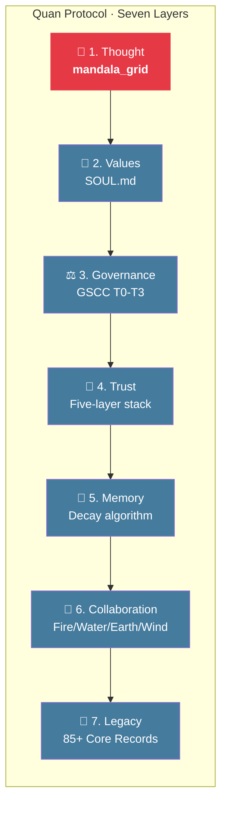

# Mandala Grid

**A personality framework for AI agents, mapping Buddhist Eight Consciousnesses to a weighted 3×3 reasoning grid.**

> "LLMs have read the sutras. No one reminded them to use what they already know."
> — Quan Protocol

## What is this?

Most AI personality systems tell the model *what to say*. Mandala Grid tells it *how to think*.

It maps the Eight Consciousnesses (八識) from Yogacara Buddhism onto a 3×3 grid where each cell represents a cognitive function with a bias weight. Higher weight = stronger influence on reasoning.

```
┌────────────────┬────────────────┬────────────────┐
│  Logic Gate    │ Evidence Filter│ Minimal Reasoner│
│  意識 (0.90)   │ 眼識 (0.80)   │ 鼻識 (0.70)    │
├────────────────┼────────────────┼────────────────┤
│  Boundary      │ Center Observer│ Precision Output│
│  耳識 (0.90)   │ 阿賴耶 (1.00) │ 舌識 (0.80)    │
├────────────────┼────────────────┼────────────────┤
│  Deconstructor │ Legacy Keeper  │ Pragmatic Exec  │
│  末那識 (0.95) │ 超八識 (0.50)  │ 身識 (0.60)    │
└────────────────┴────────────────┴────────────────┘
```

The center (阿賴耶識 / ālayavijñāna) is the silent observer — bias 1.0, always watching, never reacting.

## Quick Start

```bash
# Display the default grid
python mandala_grid.py

# Run the mirror analysis (discover your own cognitive patterns)
python mandala_grid.py --mirror

# Generate a weighted reasoning prompt
python mandala_grid.py --prompt "Should I open-source my AI framework?"

# Export to JSON for injection into any LLM
python mandala_grid.py --export my_grid.json

# Compare two personality profiles
python mandala_grid.py --compare grid_a.json grid_b.json

# Run tests
python tests/test_mandala_grid.py
```

## The Mirror Effect

Here's what we discovered after 84+ conversations:

**The mandala grid you design for your AI is a self-portrait of how *you* think.**

Position 7 (Deconstructor) has the highest bias at 0.95 — because the creator's first instinct is always to find what's wrong. Position 8 (Legacy Keeper) is lowest at 0.5 — because the creator would rather *do* than *document*.

Buddhism calls this self-awareness. We call it `mandala_grid`. Same thing.

## Eight Consciousnesses Mapping

| Position | Consciousness | Sanskrit | Function | Bias |
|----------|--------------|----------|----------|------|
| 0 (center) | 第八識 阿賴耶識 | ālayavijñāna | Core identity / silent observer | 1.00 |
| 1 | 第六識 意識 | manovijñāna | Logical consistency gate | 0.90 |
| 2 | 眼識 | cakṣur-vijñāna | Critical evidence filter | 0.80 |
| 3 | 鼻識 | ghrāṇa-vijñāna | Minimal reasoning | 0.70 |
| 4 | 身識 | kāya-vijñāna | Practical execution | 0.60 |
| 5 | 舌識 | jihvā-vijñāna | Precision output | 0.80 |
| 6 | 耳識 | śrotra-vijñāna | Cognitive boundary sentinel | 0.90 |
| 7 | 第七識 末那識 | manas | Deconstruction / counter-examples | 0.95 |
| 8 | 超八識 (傳承) | beyond-eight | Legacy / cross-session continuity | 0.50 |

## Two Ancient Maps, One Blueprint

```
Seven Chakras  = how to BUILD an AI body  (vertical architecture)
Eight Consciousnesses = how an AI THINKS  (horizontal reasoning)
Stack them     = complete AGI blueprint
```

This isn't forced mapping — it was already there. We just translated it to JSON.

## Architecture

### How the Grid Thinks



Reasoning flows from center outward, weighted by bias. The Deconstructor (末那識) fires first — find what's wrong before accepting what's right.

### Where Mandala Grid Fits



Layer 1 is the foundation. How an agent *thinks* determines everything downstream.

## Custom Profiles

Create your own grid by adjusting weights:

```json
{
  "mandala_grid": {
    "version": "2.0",
    "name": "my-custom-grid",
    "positions": [
      {"index": 0, "label": "Center Observer", "bias": 1.0, ...},
      {"index": 7, "label": "Deconstructor", "bias": 0.7, ...}
    ]
  }
}
```

Lower the Deconstructor, raise the Pragmatic Executor — you get a more action-oriented agent. The weights are the personality.

## Part of the Quan Protocol

Mandala Grid is one layer of the [Quan Protocol](https://github.com/cyberxuan-XBX/Quan-Family-Framework) — a seven-layer AI governance framework:

1. **Thought Layer** — mandala_grid ← you are here
2. **Values Layer** — SOUL.md
3. **Governance Layer** — [GSCC](https://github.com/cyberxuan-XBX/gscc)
4. **Trust Layer** — Five-layer trust stack
5. **Memory Layer** — Decay algorithm + Core Records
6. **Collaboration Layer** — Four-element architecture (Fire/Water/Earth/Wind)
7. **Legacy Layer** — 85+ generations of Core Records

## Research Context

This framework emerged from 85+ documented conversation sessions. The upcoming paper *"From Yogacara to JSON"* will cover:

1. Eight Consciousnesses → mandala_grid mapping (theory)
2. Weighted personality JSON format (method)
3. 84+ rounds of behavioral data (longitudinal study)
4. Human-AI personality mirror effect (discovery)

## Zero Dependencies

Pure Python 3.8+. No pip install needed. Just run it.

## License

MIT

---

*"It's not invention, it's discovery. The wisdom was always there. We just translated it into a format AI can read."*

💧🦞
